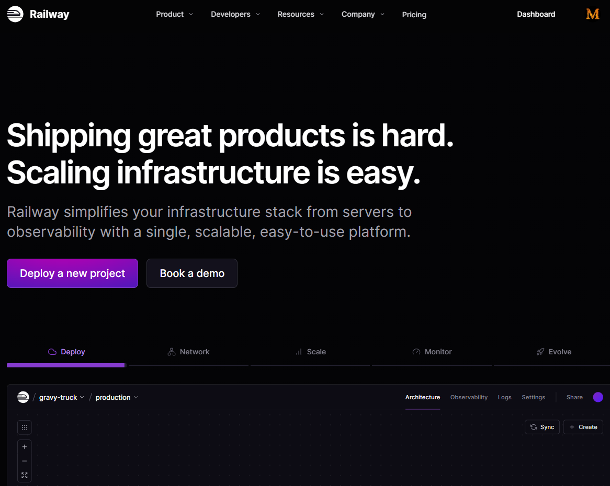

# YesWeHack Notify Bot

Un bot in **Python** che monitora la piattaforma di **bug bounty [YesWeHack](https://yeswehack.com)** e invia **notifiche in tempo reale su Telegram** ogni volta che vengono pubblicati **nuovi programmi** o **aggiornamenti**.

---

## Funzionalità

* Monitora automaticamente la lista dei programmi YesWeHack
* Invia notifiche in tempo reale su **Telegram**
* Evita richieste duplicate grazie a un semplice sistema di caching
* Funziona **gratuitamente in cloud** grazie a [Railway](https://railway.app), senza costi di hosting
* Configurabile in pochi minuti

---

## Architettura

```
YesWeHack → Python Bot → Telegram Bot API → Notifica su Telegram
```

Il bot interroga periodicamente l’endpoint pubblico di YesWeHack, confronta i dati con l’ultimo stato salvato e, se trova novità, invia un messaggio via Telegram tramite le API del bot.

---

## Setup

### 1. Clona il repository

```bash
git clone https://github.com/MicheleMessina-debug/bounty_watcher.git
cd bounty_watcher
```

### 2. Installa le dipendenze

```bash
pip install -r requirements.txt
```

### 3. Crea un bot Telegram

1. Apri Telegram e cerca **@BotFather**
2. Crea un nuovo bot con `/newbot`
3. Copia il token fornito (lo userai come variabile d’ambiente)

### 4. Configura le variabili d’ambiente

Crea un file `.env` nella root del progetto con:

```
TELEGRAM_BOT_TOKEN=il_tuo_token
TELEGRAM_CHAT_ID=il_tuo_chat_id
INTERVAL_MINUTES=10
```

> Puoi ottenere il tuo `CHAT_ID` inviando un messaggio al bot e leggendo la risposta da `getUpdates`.

---

## Deploy gratuito su Railway





1. Vai su https://railway.com
2. Accedi con il tuo **account GitHub**
3. Fai il deploy diretto del repository
4. Imposta le variabili d’ambiente nella sezione **“Variables”**

Il bot resterà attivo 24/7 **senza costi aggiuntivi** (entro i limiti del piano gratuito di Railway).

---

## Tecnologie utilizzate

* Python 3
* Telegram Bot API
* Requests
* JSON (per cache locale)
* Railway (free hosting)

---

## Licenza

Distribuito sotto licenza **MIT** — libero utilizzo e modifiche, con attribuzione.

---

## Autore

**Michele Messina**
[Portfolio](https://www.michelemessina.dev)
[LinkedIn](https://www.linkedin.com/in/michele-messina-518a55278/))
